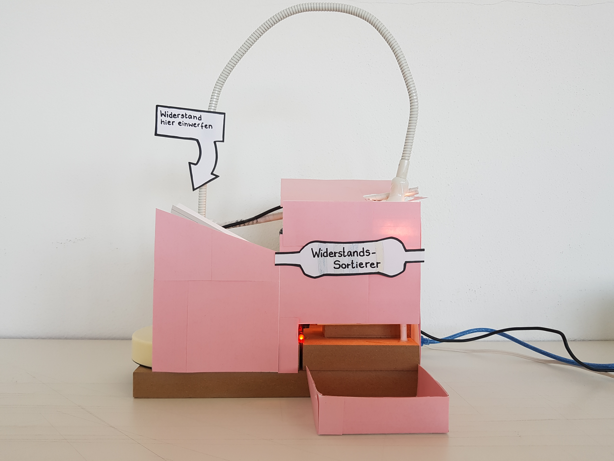
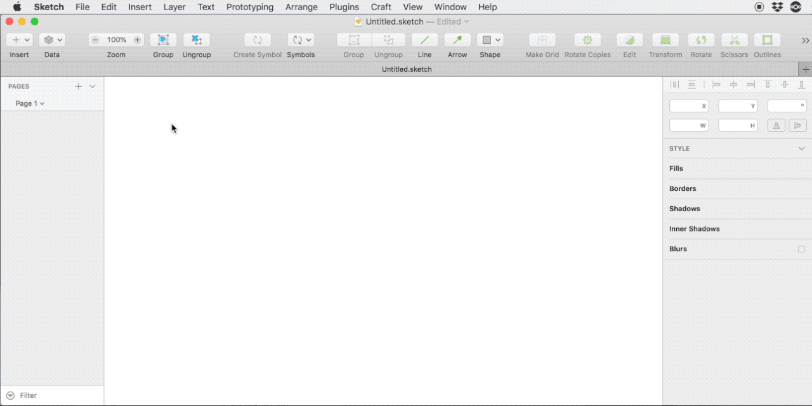
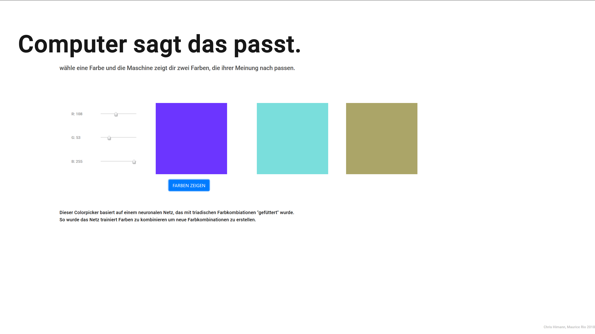
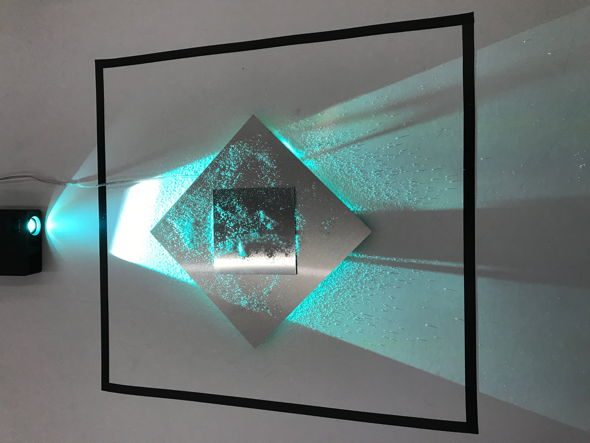
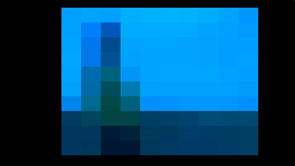
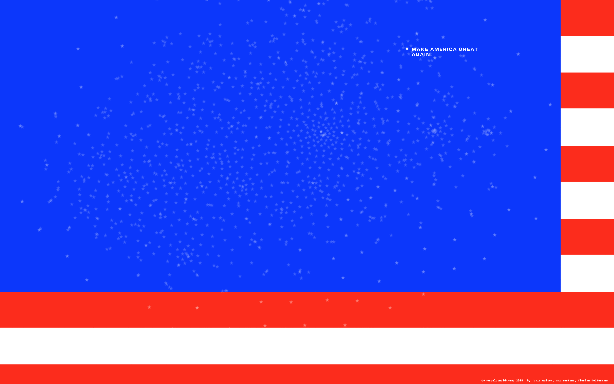
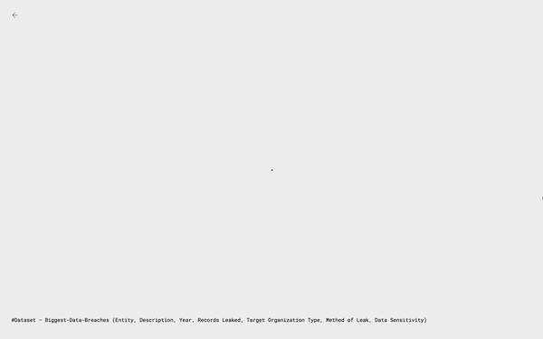
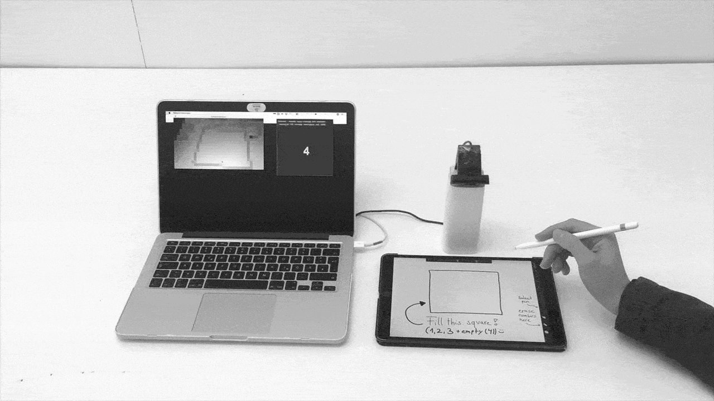

**Design für Machine Learning, Machine Learning für Design — einwöchiger Workshop an der [Hochschule für Gestaltung Schwäbisch Gmünd](https://www.hfg-gmuend.de), November 2018.**

> Durch Machine Learning (ML) lernen Computer, ohne explizit programmierte Regeln Muster in Daten zu erkennen. Die Technologie steuert autonome Fahrzeuge und Netflix-Empfehlungen, erkennt Kätzchen und Gesichter, wie wir dastehen und auf was wir stehen, Alexa spricht, Siri hört zu. 
> 
> Für Gestalter öffnen sich aufregende Möglichkeiten — individuelle User Experiences, neuartige Interfaces, der Computer als kreativer Assistent, smarte Designtools.
> 
> Was ist ML und was nicht? Wie können wir Machine Learning in unseren Projekten einsetzen, wie im Designprozess selbst? Wie gestalten wir verantwortungsvoll mit einer Technologie an der Spitze des Hype Cycle? Ziel des Workshops ist es, verschiedene ML Anwendungsbereiche kennenzulernen und in eigenen Projekten prototypisch anzuwenden (ohne dabei Hype und Mythos zu verfallen).
  
von [Philipp Schmitt](https://philippschmitt.com). Stand: November 2018.

## Einführung: Machine Learning für Designer

**[→ Download Slides](Laborwoche-ML.pdf)**

1. **Grundlagen**  
	* Was ist ML? Beispiele, Definition und ein Ausflug in die Mathematik
	* Arten von ML: Supervised, Unsupervised, Reinforcement Learning
	* Von Neural Networks zu Deep Learning: Geschichte und Grundlagen
	* Rezept für ein ML-Projekt: Begriffe, Zutaten, Ablauf  
2. **Gestaltung mit ML**
	* Notwendigkeit und Machbarkeit
	* Kontrolle und Transparenz
	* Umgang mit Unsicherheit
	* Bias & Ethik
	* Hype und Mythos
3. **Projekt-Showcase**
4. **Werkzeuge und Ressourcen**
	* Demo: [Wekinator](http://www.wekinator.org)
	* Demo: [Runway](https://runwayapp.ai)
	* Demo: [ml5.js](https://ml5js.org)
	* Demo: [t-SNE.js](https://cs.stanford.edu/people/karpathy/tsnejs/)
	* Demo: [brain.js](https://github.com/BrainJS/brain.js)

## Links / Quellen
Eine Liste von Ressourcen, die ich persönlich nützlich finde. Nicht als vollständige Referenz zu sehen, sondern als Einstieg.

### Technologie
#### Tutorials, Bücher, Artikel, …
* [Eine visuelle Einführung ins Maschinelle Lernen](http://www.r2d3.us/visuelle-einfuehrung-ins-maschinelle-lernen-teil-1/)
* [Machine Learning for Artists (ml4a)](http://ml4a.github.io), insb. [The Neural Aesthetic](http://ml4a.github.io/classes/itp-F18/)
* “The Coding Train”, z.B. [A Beginner's Guide to Machine Learning with ml5.js](https://www.youtube.com/watch?v=jmznx0Q1fP0)
* [Machine Learning is Fun](https://medium.com/@ageitgey/machine-learning-is-fun-80ea3ec3c471)
* [ML Glossary](https://ml5js.org/docs/glossary-machine-learning)
* [Introduction to machine learning](http://mitpress.mit.edu/books/introduction-machine-learning-third-edition), Ethem Alpaydin
#### Tools
* [Wekinator](http://www.wekinator.org)
* [Runway](http://runwayapp.ai)
* [ml5.js](https://ml5js.org)
* [Brain.js](https://github.com/BrainJS/brain.js)
* [Google Cloud AI](https://cloud.google.com/products/ai/), z.B. [Vision API](https://cloud.google.com/vision/)
* [Clarifai](https://clarifai.com)
* [Microsoft Cognitive Services](https://azure.microsoft.com/en-us/services/cognitive-services/)
* [scikit-learn](http://scikit-learn.org)
* [AutoML](https://cloud.google.com/automl/)

### Design  
* [The UX of AI](https://design.google/library/ux-ai/)
* [The Intelligence Augmentation Design Toolkit](http://iadesignkit.com)
* [Machine Learning for Designers](https://www.oreilly.com/learning/machine-learning-for-designers)  
* [What designers need to know about machine learning](https://hackernoon.com/what-designers-need-to-know-about-machine-learning-109a12fdd3af), Emma Rosenberg
* [The Designer's Guide to Machine Learning](https://digitalist.global/talks/the-designers-guide-to-machine-learning/), Cris Christina
* [Applications Of Machine Learning For Designers](https://www.smashingmagazine.com/2017/04/applications-machine-learning-designers/), Lassi A Liikkanen
* [Algorithm-Driven Design: How Artificial Intelligence Is Changing Design](https://www.smashingmagazine.com/2017/01/algorithm-driven-design-how-artificial-intelligence-changing-design/), Yury Vetrov
* [Experience Design in the Machine Learning Era](https://medium.com/@girardin/experience-design-in-the-machine-learning-era-e16c87f4f2e2), Fabien Girardin
* [AI UX: 7 Principles of Designing Good AI Products](https://uxstudioteam.com/ux-blog/ai-ux/), Dávid Pásztor
* [Human-Centered Machine Learning](https://medium.com/google-design/human-centered-machine-learning-a770d10562cd), Josh Lovejoy and Jess Holbrook
* [Machine Learning and User Experience: A Few Resources](https://medium.com/ml-ux/machine-learning-and-user-experience-a-few-resources-e7872f1d34ee), Michelle Carney

### Philosophie, Geschichte, Ethik, …
* [Machines that Morph Logic: Neural Networks and the Distorted Automation of Intelligence as Statistical Inference](http://www.glass-bead.org/article/machines-that-morph-logic/?lang=enview), Matteo Pasquinelli
* [How To Recognize Exclusion in AI](https://medium.com/microsoft-design/how-to-recognize-exclusion-in-ai-ec2d6d89f850), Chou et al.
* [Everyday Ethics for Artificial Intelligence](https://www.ibm.com/watson/assets/duo/pdf/everydayethics.pdf)
* [It's ML, not magic: simple questions you should ask to help reduce AI hype](https://smerity.com/articles/2016/ml_not_magic.html), Smerity
* [AINow Institute Symposium 2018](https://symposium.ainowinstitute.org)
* [Data & Society](https://datasociety.net)
* [The Man Who Tried to Redeem the World with Logic](http://nautil.us/issue/21/information/the-man-who-tried-to-redeem-the-world-with-logic), Amanda Gefter
* [The Great A.I. Awakening](https://www.nytimes.com/2016/12/14/magazine/the-great-ai-awakening.html), Gideon Lewis-Kraus

### Showcase
* [CreativeAI](http://www.creativeai.net)
* [Algorithms.design](http://algorithms.design)
* [Speculative Authentications](https://passwords.ai)

## Studenten-Projekte

### Widerstandssortierer

Widerstand einwerfen, Ohmzahl ablesen, fertig. **Michelle Bauch** und **Aaron Eichler** haben mit Wekinator ein Model trainiert dass elektronische Widerstände anhand ihres Farbcodes erkennt.

### [NeuraLorem](https://github.com/Radialarray/neuralorem) 

**[NeuraLorem](https://github.com/Radialarray/neuralorem)** von [Sven Löchner](http://sven-loechner.com) ist ein Plugin für Sketch zur Erstellung von Lorem Ipsum Fülltext. Das Plugin generiert den Text basierend auf der Eingabewörter und versucht, anstelle des Standard Lorem Ipsum Fülltextes einen kontextbasierten Fülltext zu erstellen. 
Das Projekt basiert auf minimaxir/textgenrnn, einem Neural Network zur Textgenerierung.

### ML Colorpicker

**[Christopher Himann](http://github.com/ChRIisS97)** und **Maurice Rio** haben einen ML Color Picker entwickelt. Der Benutzer wählt eine Farbe aus und ein Neurales Netzwerk ergänzt zwei weitere. Der ML Color Picker basiert auf [brain.js](https://github.com/BrainJS/brain.js) und wurde mit Farbharmonien trainiert.

### (Un)Sichtbare Emotionen

(Un)Sichtbare Emotionen, von Maximilian Härle und [Tobias Haag](https://iot.hfg-gmuend.de/student:tobias-haag), erkennt per Webcam Gesichtsaustrücke, versucht Emotionen zu erkennen und setzt die Daten in Farben und Frequenzmuster aus Salzkristallen um. Das räumlich-visuelle Konzept hat die Absicht, dass eine Person vor dem Screen steht und die zum Gesichtsausdruck verbundene Farbe wahrnimmt und eine andere Person das „Emotionsmuster“ erkennt.

### Pixelsound

Pixelsound von [Laura Humpfer](http://laurahumpfer.de) und [Monika Litzinger](monikalitzinger.de)  verwandelt mit Hilfe von Wekinator visuellen Input in auditiven Output.

### @therealdonaldtrump Tweet Map

[Florian Deitermann](http://floriandeitermann.com), [Janis Walser-Cofalka](http://janiswalser.de) und [Max Mertens](http://max-mertens.com) haben mit Hilfe von t-SNE, Bag-of-Words und p5.js Tweets des US-Präsidenten visualisiert, um Rhetorik visuell erkenntlich zu machen.

### Visualizing how the machine learns

Datenkunst mit t-SNE von [Florian Deitermann](http://floriandeitermann.com), [Janis Walser-Cofalka](http://janiswalser.de) und [Max Mertens](http://max-mertens.com).

### Handschrift-Erkennung

[Valerie Grappendorf](www.linkedin.com/in/valerie-grappendorf-6714a6159) hat mit Wekinator und Processing eine Handschrift-Erkennung programmiert.

*Herzlichen Dank an die motivierten Studenten, die HfG Schwäbisch Gmünd sowie an die zahlreichen Autoren von Open-Source Tools und Lernmaterialien, auf denen dieser Workshop basiert!*
